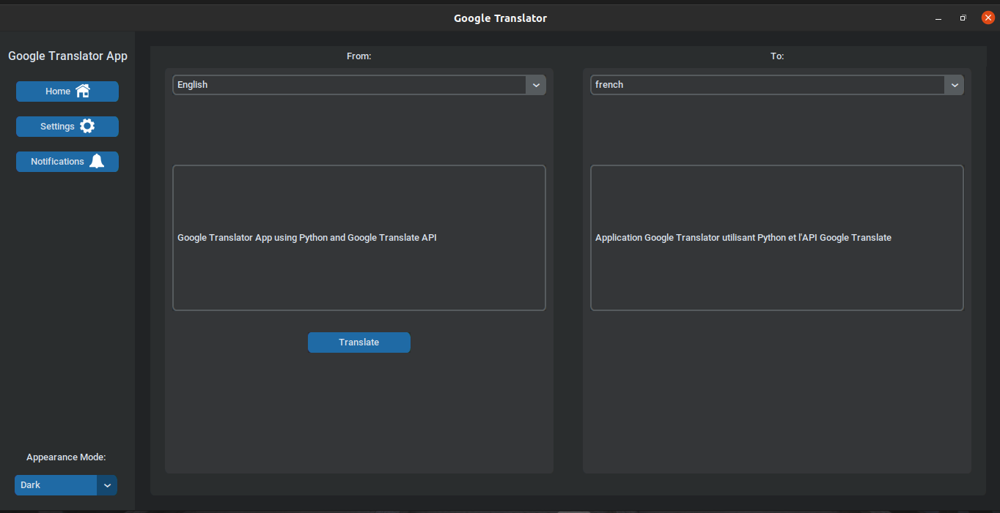
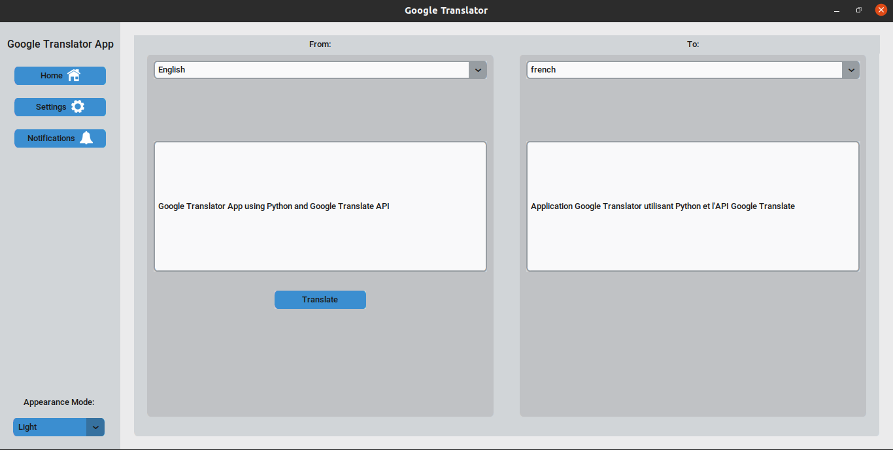

# Google Translator App
# Contributors of this Project
## By Maureen Njihia and Joanne Gitari on 26th November 2022
# Description
Google Translate App is an application built using Python3 uses the Google Translate API to translate text from one language to another.
# Setup Requirements
* Git
* Github
* Web Browser (Chrome or Frefox)
* Google Translate API (https://pypi.org/project/googletrans/)
* Python 3.8 (https://www.python.org/downloads/release/python-380/)
# Setup Installation
* Copy the link of this repository.
```
https://github.com/Njihia413/Google-Translator-App.git
```
* Clone it to your local machine.
```
$ git clone https://github.com/Njihia413/Google-Translator-App.git
```
* Open terminal and navigate to the directory of the project.
```
$ cd Google-Translator-App
```
* Run the following commands to install the required dependencies.
```
$ pip install tk
```
```
$ pip install customtkinter
```
```
$ pip install googletrans
```
```
$ sudo apt-get install -y python-pil.imagetk
```
# Technologies Used
* Python 3.8
* Tkinter GUI
* CustomTkinter UI Library
# Some Screenshots
* Dark Mode Version

<br/>

* Light Mode Version

<br/>

# Known Bugs
There are no known bugs of this project at the moment 😎.
# Support and contact details
For any contributions towards this project:
* Email: developer.njihia@gmail.com / gitarijoanne@gmail.com
* Phone: 0704592362 / 0706804187
# License
Copyright (c) 2022 University of Nairobi

Permission is hereby granted, free of charge, to any person obtaining
a copy of this software and associated documentation files (the
"Software"), to deal in the Software without restriction, including
without limitation the rights to use, copy, modify, merge, publish,
distribute, sublicense, and/or sell copies of the Software, and to
permit persons to whom the Software is furnished to do so, subject to
the following conditions:

The above copyright notice and this permission notice shall be
included in all copies or substantial portions of the Software.

THE SOFTWARE IS PROVIDED "AS IS", WITHOUT WARRANTY OF ANY KIND,
EXPRESS OR IMPLIED, INCLUDING BUT NOT LIMITED TO THE WARRANTIES OF
MERCHANTABILITY, FITNESS FOR A PARTICULAR PURPOSE AND
NONINFRINGEMENT. IN NO EVENT SHALL THE AUTHORS OR COPYRIGHT HOLDERS BE
LIABLE FOR ANY CLAIM, DAMAGES OR OTHER LIABILITY, WHETHER IN AN ACTION
OF CONTRACT, TORT OR OTHERWISE, ARISING FROM, OUT OF OR IN CONNECTION
WITH THE SOFTWARE OR THE USE OR OTHER DEALINGS IN THE SOFTWARE.